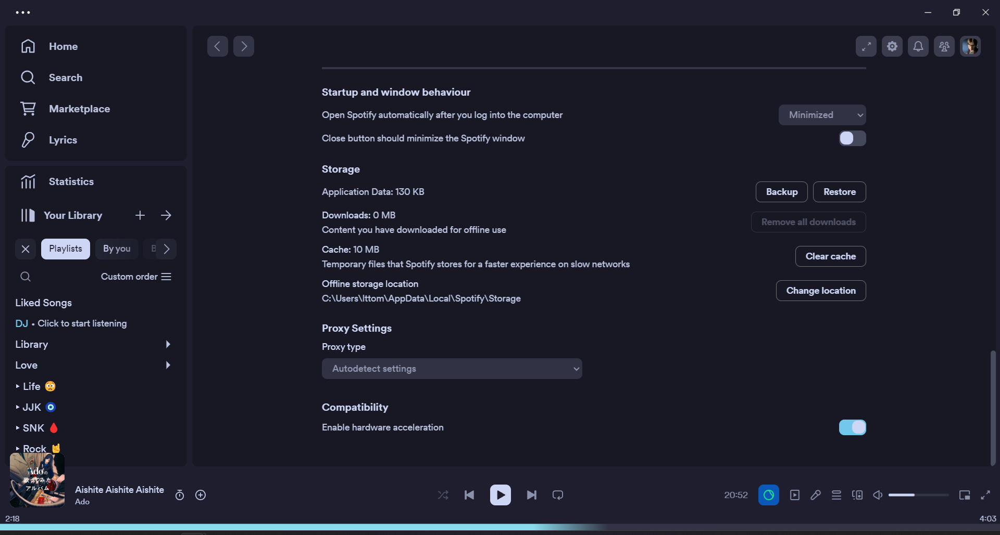

## Information

### 🛠️ Recommended Versions

| Software | Version | Link |
| :--- | :--- | :--- |
| **Spicetify** | `v2.38.5` | [View Releases](https://github.com/spicetify/spicetify-cli/releases) |
| **Spotify** | `1.2.51` | [Check Compatibility](https://docs.google.com/spreadsheets/d/1wztO1L4zvNykBRw7X4jxP8pvo11oQjT0O5DvZ_-S4Ok/edit#gid=803394557&range=D2) |

Please check out the readme for each extension in its folder, it will include installation instructions, usage, and compatibility notes.

## [spotifyBackup](spotifyBackup/README.md)

## [gamepad](gamepad/README.md)

## [immersiveView](immersiveView/README.md)

## [pixelatedImages](pixelatedImages/README.md)

## [noControls](noControls/README.md)

## [playbarClock](playbarClock/README.md)

## [quickQueue](quickQueue/README.md)

## [scannables](scannables/README.md)

## [sleepTimer](sleepTimer/README.md)

## [toggleDJ](toggleDJ/README.md)

## [tracksToEdges](tracksToEdges/README.md)

## [volumePercentage](volumePercentage/README.md)

