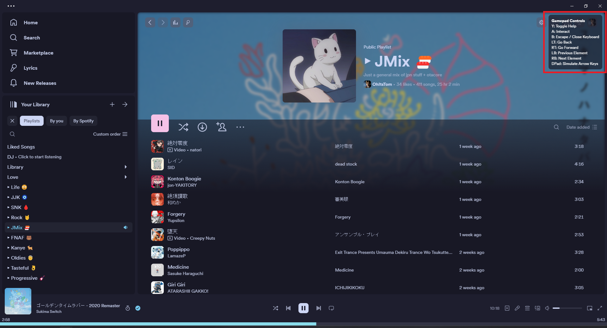

## Information

Please check out the readme for each extension in its folder, it will include installation instructions, usage, and compatibility notes.

## [gamepad](gamepad/README.md)

## [immersiveView](immersiveView/README.md)

## [pixelatedImages](pixelatedImages/README.md)

## [noControls](noControls/README.md)

## [playbarClock](playbarClock/README.md)

## [quickQueue](quickQueue/README.md)

## [scannables](scannables/README.md)

## [sleepTimer](sleepTimer/README.md)

## [toggleDJ](toggleDJ/README.md)

## [tracksToEdges](tracksToEdges/README.md)

## [volumePercentage](volumePercentage/README.md)

