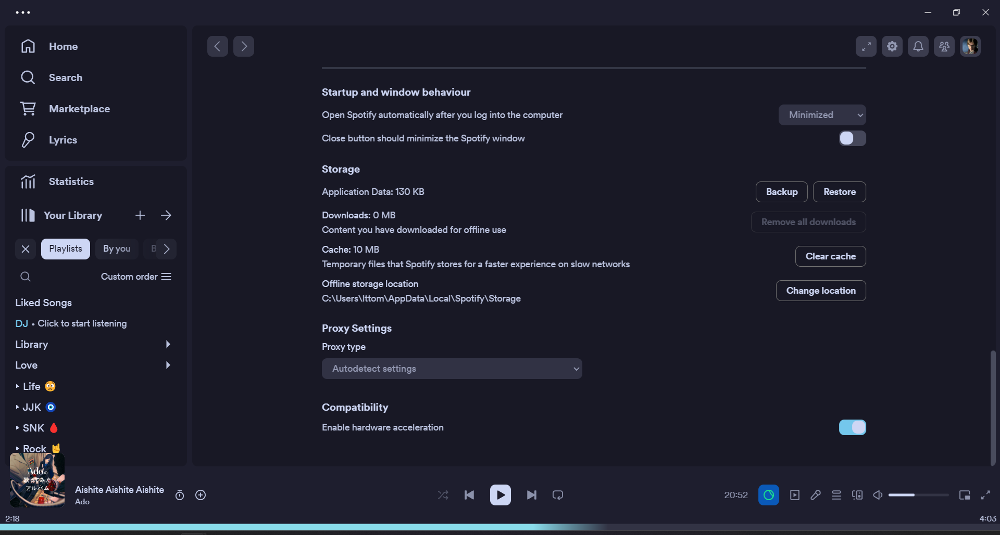
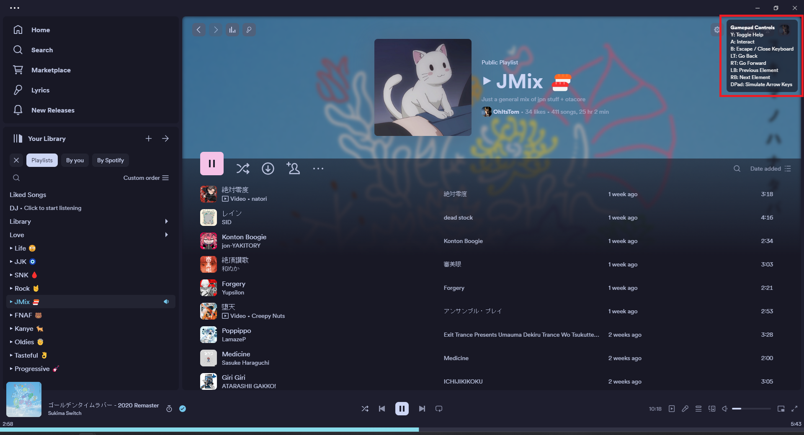

## Information

### 🛠️ Supported Versions

This historical branch aims to store my original creative vision for my extensions. These extensions will not work on any version other than the ones listed below:

| Software | Version | Link |
| :--- | :--- | :--- |
| **Spicetify** | `v2.38.5` | [View Releases](https://github.com/spicetify/spicetify-cli/releases) |
| **Spotify** | `1.2.51` | [Check Compatibility](https://docs.google.com/spreadsheets/d/1wztO1L4zvNykBRw7X4jxP8pvo11oQjT0O5DvZ_-S4Ok/edit#gid=803394557&range=D2) |

> 💡 **Tip:** For a seamless setup of these specific versions, I recommend using my partner tool, **[Spicetify Easy-Install (v3.7 Beta)](https://github.com/ohitstom/spicetify-easyinstall/releases/tag/3.7)**.

Please check out the README inside each extension's folder for individual installation instructions, usage guidelines, and compatibility notes.

## [spotifyBackup](spotifyBackup/README.md)

## [gamepad](gamepad/README.md)

## [immersiveView](immersiveView/README.md)

## [pixelatedImages](pixelatedImages/README.md)

## [noControls](noControls/README.md)

## [playbarClock](playbarClock/README.md)

## [quickQueue](quickQueue/README.md)

## [scannables](scannables/README.md)

## [sleepTimer](sleepTimer/README.md)

## [toggleDJ](toggleDJ/README.md)

## [tracksToEdges](tracksToEdges/README.md)

## [volumePercentage](volumePercentage/README.md)

