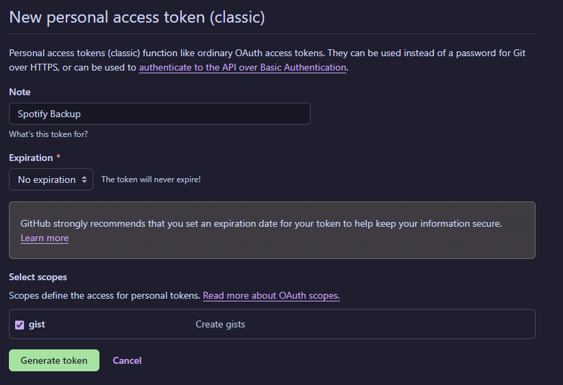
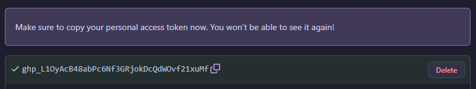
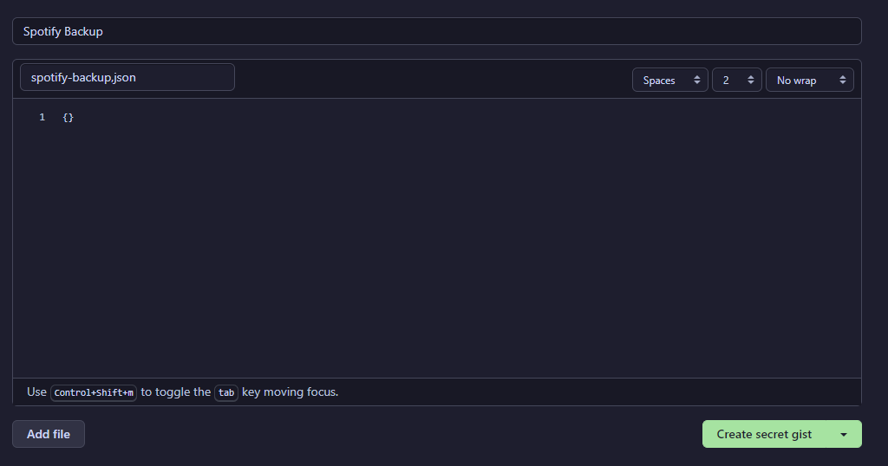
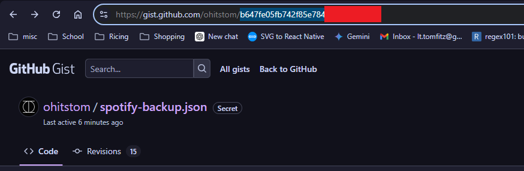

# spotifyBackup.js

_This script allows you to backup / restore application data (settings)._

### Installation

1. Install [Spicetify](https://spicetify.app) and set it up according to the instructions.
2. Navigate to your Spicetify config directory via the command `spicetify config-dir`.
3. Download spotifyBackup.js and place it in `/extensions`.
4. Run `spicetify config extensions spotifyBackup.js` and `Spicetify apply` in terminal.

### Usage

Navigate to Spotify settings, scroll to "Storage", backup your settings to clipboard - and import them on your secondary device.

#### Gist Integration Setup
This extension also allows the user to automatically backup and restore to a GitHub Gist.
Please note that Gist has a limited file upload of 1MB. If your application data exceeds this value please manually backup and restore your data.

##### Github Token
There should be no security issues with storing your GitHub access token in local storage assuming you setup permissions to the token correctly, however if you want to be on the safe side make a throw away GitHub account.

1. Head over to https://github.com/settings/tokens
2. Generate a new **classic** token:

3. Copy the token:

##### Gist ID
1. Head over to https://gist.github.com/
2. Create a secret Gist like so:

3. Copy the ID from the search bar:

### Compatibility

Relies on platform methods, and css map / dom structure.